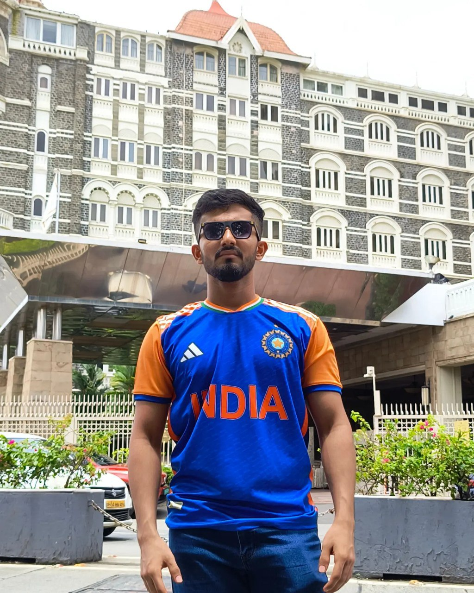
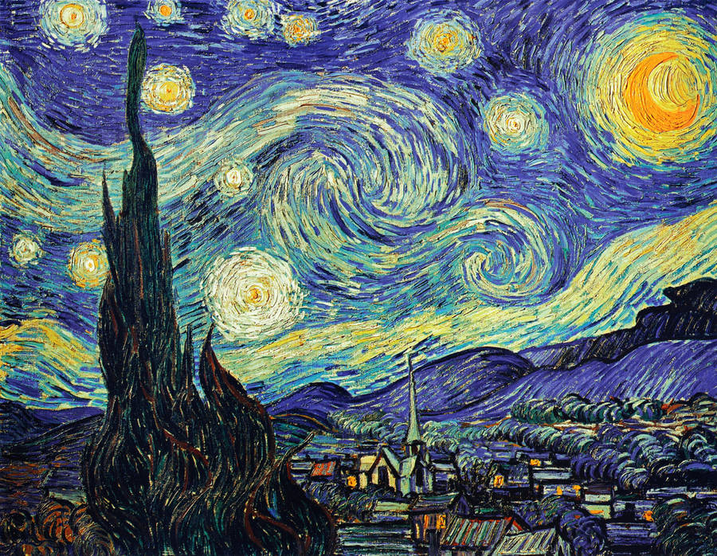
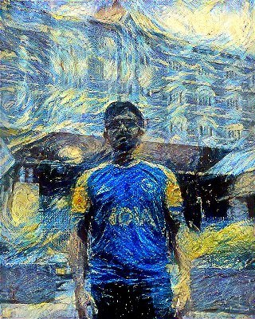

# A very simple neural style transfer using VGG
By default we use vgg16 but you can add your favourite model into models directory 

## What is neural style transfer?

Neural style transfer is very simple trick that exploits the feature maps learned by CNN models to impose style of one image onto another without changing the content of it. 

## How does it work?

We freeze the weights of the model and optimize the image using content loss, style loss, and total variation loss. 

- Content loss is mean squared error loss between content image feature maps and feature maps of target image. 

- Style loss is also a mean squered error but between gram matrixes of feature maps of style image and target image

- Variation loss is the loss between horizontal pixels to vertical pixels (smoothens the appearance)

## Sample output 

